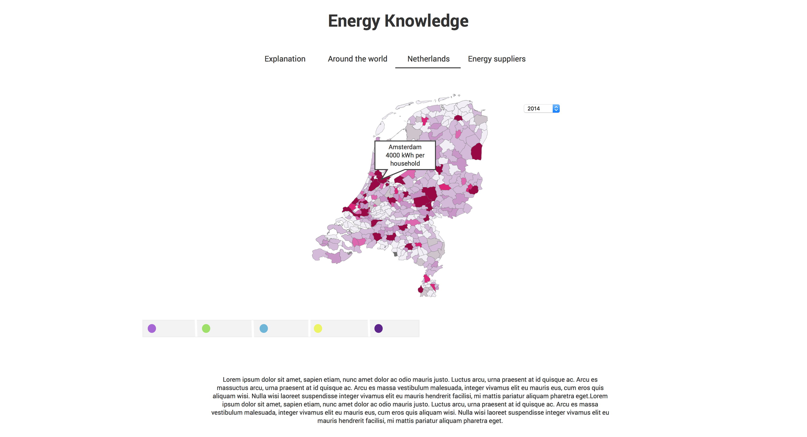

# Design Document
###### Sanne Strikkers 11170816

### Diagram

Bovenstaande afbeelding geeft een bestandsindeling weer. Aangezien er in HTML geen functies of methodes worden gebruikt. Wel in de JavaScript bestanden, maar deze worden later pas bekend.

Voor elke pagina is er een ander bestand. Neem als voorbeeld world.html. Bij dit bestand horen de volgende bestanden: world.py, world.json en worldmap.js. Zo worden er ook geen functies door elkaar gehaald.

### UI Schetsen

#### Pagina 0
Hier wordt er uitgelegd wat het verband is tussen alle pagina’s. Ook worden er algemeenheden vermeld, zoals wat is energie? Hoe werkt het precies in Nederland?

#### Pagina 1

Op deze pagina wordt een wereldmap weergegeven. Hierbij kan men kiezen uit meerdere jaren. Ook kan men op een jaar klikken waardoor er een bar grafiek ontstaat waardoor men landen met elkaar kan vergelijken, onder andere Nederland. Een optionele keuze (ivm tijd) kan men een land invoeren en toevoegen aan de bar grafiek. 

Onder de wereldmap staat een legenda. Onder de legenda bevindt zich weer een uitleg over de kaart.

#### Pagina 2

Op pagina 2 wordt er een kaart van Nederland laten zien tot in de kleinste detail. Men kan over de kaart heen gaan zodat een tooltip ontstaat. Waarop het verbruik per huishouden is te zien. Hierbij kan men ook weer kiezen uit een jaar. Een eventuele optie is om ook gas erbij te voegen. Als eerste wordt er gefocust op elektriciteit.

Net als op de vorige pagina komt er een legenda met een kleine uitleg over de map.

#### Pagina 3

Op de laatste pagina kan men de energieleveranciers van Nederland bekijken. Daarbij ziet men de samenstelling van het energie. Is het energie wel zo groen, als er gezegd wordt? Onder de donut grafiek kan men een uitleg zien.

### API en frameworks

* Bootstrap
  * http://getbootstrap.com
* D3 JavaScript
  * https://d3js.org
* Leaflet JS
  * http://leafletjs.com

### Data

* Elektriciteit verbruik per huishouden over de wereld
  * https://wec-indicators.enerdata.eu/
    * Jaren: 2000, 2005, 2010, 2011, 2012, 2013, 2014
    * Verbruik in kWh
* Elektriciteit en gas verbruik per huishouden per postcode in Nederland
  * Cogas Infra en Beheer
  * Enduris
  * Endinet
  * Enexis
  * Liander
  * RENDO Netwerken
  * Stedin
  * Westland Infra
    * Jaren: 2013, 2014, 2015
    * Verbruik in kWh en m3
* Alle erkende energieleveranciers van Nederland
  * https://consuwijzer.nl/energie/vergelijken-overstappen/energiebedrijven-vergelijken/toelichting-bij-de-herkomst-van-energie
    * Samenstelling energie van energieleveranciers
    * Zowel groen als grijs
* Alle postcodes met plaatsen en provincies van Nederland
  * http://download.geonames.org/export/zip/
