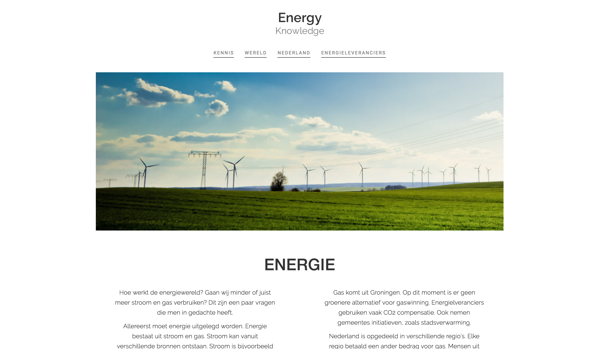
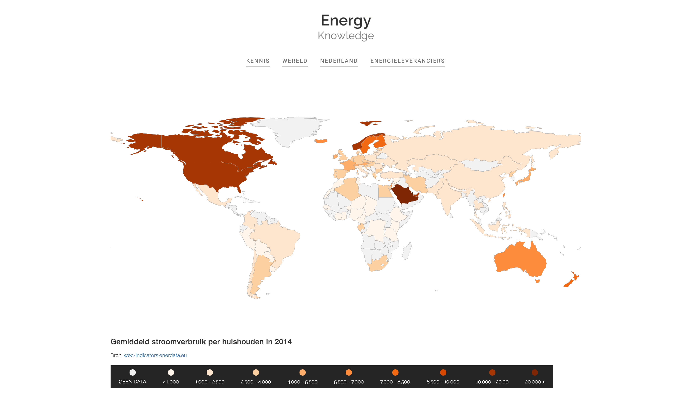
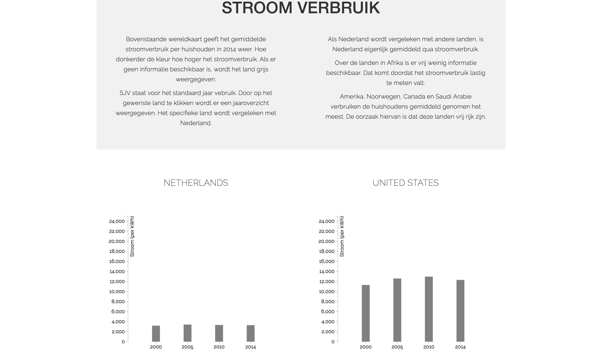
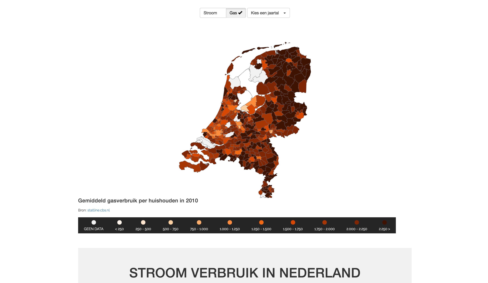
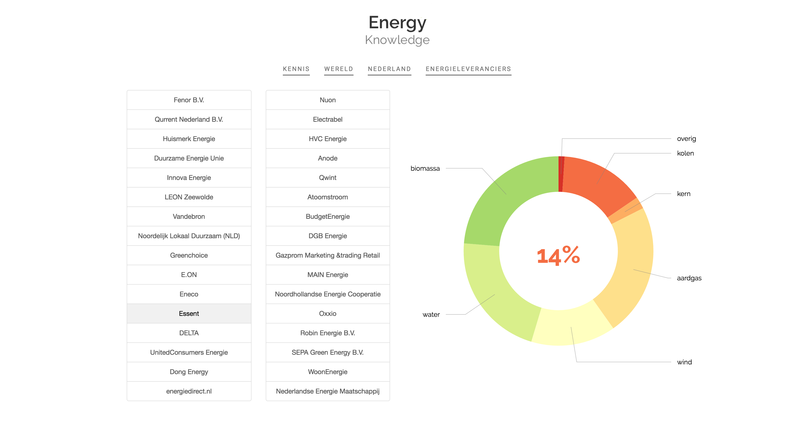

# Programmeer Project Data 2016 
###### Sanne Strikkers 11170816

### Het doel

Het probleem bij de inwoners van Nederland is dat men geen inzicht heeft in het gemiddeld energie (stroom en gas) verbruik. De meeste mensen houden niet bij hoeveel energie zij verbruiken. Zo kan er vergeleken worden per jaar of men meer energie verbruikt. Om te beginnen moet er worden vergeleken of Nederland wel zo veel verbruikt ten opzichte van andere landen in de wereld.

Ook heeft de Nederlandse inwoner geen overzicht meer van alle energieleveranciers die lopende der jaren zijn bijgekomen. Vroeger begon het met twee of drie energieleverancier, maar nu zijn er wel meer dan tien bijgekomen. Men ziet daarbij ook niet waar deze Nederlandse energieleverancier hun energie vandaan halen. Zijn deze energieleveranciers wel zo groen of grijs zoals ze beweren? De gemiddelde Nederlander laat zich misleiden doordat sommige leveranciers beweren dat zij groen zijn terwijl ze helemaal niet groen zijn. Om voor dat soort leveranciers te kiezen beïnvloedt toch de keuze van de gemiddelde Nederlandse inwoner.

Het doel is om men te informeren over de energiewereld met name in Nederland. Verbruikt Nederland veel ten op lichte van andere landen? Waar verbruikt men in Nederland het meeste stroom en gas? Verbruikt Nederland minder stroom en gas lopende der jaren? Welke energieleveranciers zijn er in Nederland? Waar komt het stroom vandaan die de leveranciers leveren? Door deze vragen te beantwoorden krijgt Nederland meer inzicht in de energiewereld.

### Pagina’s

#### Wereld

#### Wereld

#### Nederland

#### Energieleveranciers

### Externe componenten

#### Data
- [ConsuWijzer](https://www.consuwijzer.nl/energie/vergelijken-overstappen/energiebedrijven-vergelijken/toelichting-bij-de-herkomst-van-energie)
- [Energy Efficiency Indicators](https://wec-indicators.enerdata.eu/)
- [CBS Gemeentelijke indeling op 1 januari 2015](https://www.cbs.nl/nl-nl/onze-diensten/methoden/classificaties/overig/gemeentelijke-indelingen/indeling%20per%20jaar/gemeentelijke-indeling-op-1-januari-2015)
- [CBS Energieverbruik particuliere woningen](http://statline.cbs.nl/StatWeb/publication/?DM=SLNL&PA=81528NED)

#### Website
- [D3 JavaScript](https://d3js.org)
- [Library Bootstrap](http://getbootstrap.com)
- [D3-tooltips plugin](http://labratrevenge.com/d3-tip/)
- [Bootstrap-select plugin](http://silviomoreto.github.io/bootstrap-select/)
- [D3 DataMaps](http://datamaps.github.io)
- [jQuery](http://jquery.com)

### License

[The MIT License (MIT)
Copyright © 2016 Sanne Strikkers](../master/LICENCE.md)

